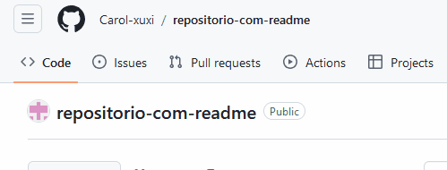

# Projeto com README
Um projeto de teste com um arquivo README 🤩

[  ](https://github.com/Carol-xuxi/repositorio-com-readme)

## Tecnologias Utilizadas
-HTML
-CSS
-JS

## Como utilizar

1 - Clone para o projeto
```
git clone (url)
``` 
2 - Acesse a pasta do projeto
```
cd repositorio-com-readme
``` 

